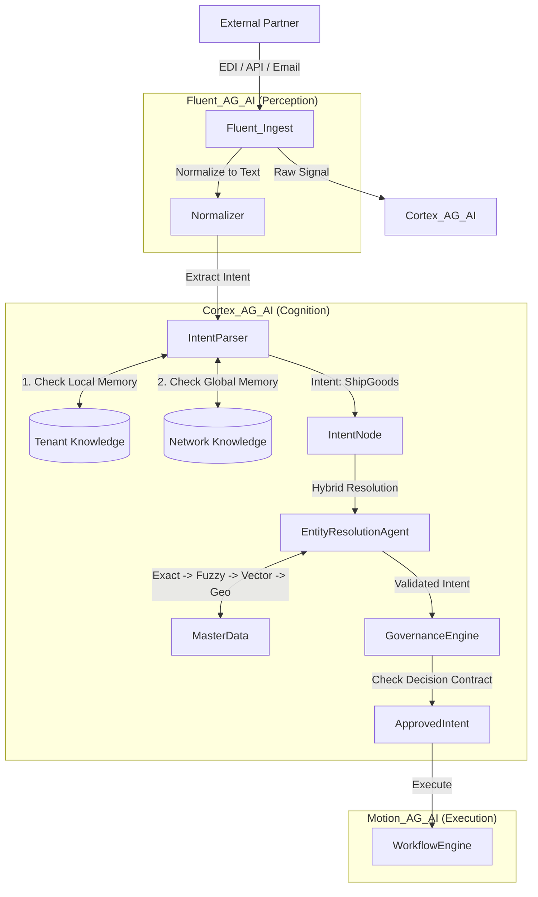

# Architecture & Design: The Networked Intent Hub

**Version**: 9.3 (Agentic Core)
**Pattern**: Hub-and-Spoke Cognitive Architecture with Federated Knowledge.  
**Modules**: `Cortex`, `Fluent`, `Motion`

## 1. High-Level Diagram



## 2. Key Upgrades

### A. Federated Knowledge Layers
1.  **Local Memory**: Tenant specific quirks. (e.g., "My contact at Target is Bob"). Priority 1.
2.  **Global Memory**: Anonymized network facts. (e.g., "Target DC 555 is located at 123 Main St"). Priority 2.
    *   *Implementation*: A shared `Global Entity` DocType synced across sites (or central lookup API).

### B. Hybrid Entity Resolution
The `EntityResolutionAgent` now follows a strict waterfall:
1.  **Exact Match**: Hash-to-Hash.
2.  **Structured Match**: Address Normalization (Libpostal) -> Match.
3.  **Geospatial**: "Is the coordinate within 500m of a known Master Entity?"
4.  **Vector/Semantic**: Only used if above fail.

### C. Constrained Generation
The `ArchitectAgent` (Onboarding) now uses **Structured Decoding**.
*   Instead of asking LLM for "JSON", we provide a Pydantic Model of the `IntentMap` DocType.
*   This guarantees 100% syntactically valid imports.

## 3. Data Flow with Feedback

**The "Teacher" Loop**:
1.  `Motion` executes an action.
2.  Human overrides the action.
3.  **Cortex Intervenes**: "Why did you override?"
4.  Human selects: "Permanent Rule Change".
5.  `Cortex` updates `LocalGraph`.
6.  If `Confidence > 99%` across 5 tenants, `Cortex` promotes rule to `GlobalGraph` (Anonymized).

---
**Summary**: This architecture solves the "Cold Start" problem by leveraging the collective intelligence of the entire Flowwolf user base.

## 4. Performance & Caching Strategy (Architectural Upgrade)

### A. The Vector Latency Problem
Vector Search is slow (50-200ms). Doing this for every segment is non-viable.

### B. The Redis Solution
The `EntityResolutionAgent` implements a **3-Layer Cache**:
1.  **L1 (Memory)**: Exact String Match (Hash Map). Speed: <1ms.
2.  **L2 (Redis)**: "Fuzzy Key" Lookup. Speed: 5ms.
3.  **L3 (Vector DB)**: Semantic Search (Fallback only). Speed: 100ms.

**Result**: 95% of lookups hit L1/L2, ensuring high throughput.

## 5. Saturn Stability Layer (v6.0 Upgrade)

To ensure the system survives "Bad Customers" and "Failed Integrations", we introduce the Saturn Layer.

### A. The Schema Registry (Contract Enforcement)
*   **Problem**: Agent A outputs `{ "id": 123 }`, Agent B expects `{ "uuid": "123" }`. Crash.
*   **Solution**: **Strict Schema Registry**.
    *   Every Intent Type (`ShipGoods`) has a semantic version (v1.0, v1.1).
    *   Every inter-agent call MUST validate against the Pydantic Schema of that version.
    *   **Bad Data** is rejected at the *boundary*, never allowed to pollute domain logic.

### B. Event Versioning Strategy
*   **Strategy**: **Upcasting**.
    *   The system always stores the *latest* version of an Intent Schema.
    *   When an old parsed signal arrives (v1.0), an `Upcaster` adapter converts it to v2.0 before it hits the `Intent Graph`.
    *   This ensures the Core Logic (`Motion`) only ever deals with the *Current Truth*.

### C. Circuit Breakers & Isolation
*   **Problem**: Partner X starts sending 10,000 malformed EDI 214s/hour. The Parser queue clogs. Everyone suffers.
*   **Solution**: **Tenant-Aware Circuit Breakers**.
    *   If Error Rate for Partner X > 10% in 5 mins -> **Open Circuit** (Reject all traffic from Partner X for 30 mins).
    *   Alert Ops.
    *   Rest of the network remains unaffected.

## 6. Jupiter Autonomy Layer (v7.0 Upgrade)

### A. The Agent-to-Agent (A2A) Protocol
To enable the "10-Year Vision" of negotiation, we define a standard communication protocol between agents.
*   **Format**: JSON-LD (Linked Data).
*   **Verbs**: `PROPOSE`, `ACCEPT`, `REJECT`, `COUNTER`.
*   **Example**:
    *   Shipper Agent sends `PROPOSE { "pickup": "10:00" }`.
    *   Carrier Agent checks constraints (Driver availability).
    *   Carrier Agent sends `COUNTER { "pickup": "14:00" }`.

### B. The Policy-Driven Decision Engine
Hardcoded logic is brittle. We move business rules into **Policy DocTypes**.
*   **DocType**: `Decision Policy`
    *   Logic: `json_logic` or Python Expression.
    *   Example: `load.value > 5000 and partner.trust_score < 80`.
*   **Execution**: The `GovernanceEngine` loads huge sets of Policies dynamically. This allows Operations Teams to change AI behavior instantly without deploying code.

### C. Symmetric Overrides
*   **Human Override**: Human corrects AI. (Standard).
*   **AI Override (New)**: AI blocks Human.
    *   Scenario: Junior Dispatcher tries to book a Carrier with an expired Insurance Cert.
    *   Action: `Cortex` intervenes: "Action Blocked: Policy Violation #99 (Expired Insurance). Request Supervisor Override."

## 7. The Extension Seams (v9.0 Freeze)

To protect the Core from code bloat, we define explicit **Seams** where extensions can live. **No new features shall be added to Core unless they serve 80% of all tenants.**

### A. The Protocol Seam (`Fluent`)
*   **Core**: Handles `Raw Signal` -> `Intent` lifecycle.
*   **Extended**: Specific parsers (X12, Edifact, PDF) are **Plugins**.
*   **Result**: If Edifact changes, only the `Edifact Plugin` updates. The Core remains frozen.

### B. The Policy Seam (`Motion`)
*   **Core**: Handles `Intent` -> `Transaction` conversion.
*   **Extended**: Business logic (e.g., "If $5k, hold for review") lives in **Policy DocTypes**, not Python logic.
*   **Result**: Business Logic is data, not code.

### C. The Skill Seam (`Cortex`)
*   **Core**: Handles `Intent Graph` traversal and `Governance`.
*   **Extended**: Domain logic (e.g., "Calculate Duty") lives in **3rd Party Skills**.
*   **Result**: The Brain stays generic; the skills become specific.

## 8. Global Resolution Strategy (v9.5 Patch)

To support Global Forwarding (Air/Ocean), the `EntityResolutionAgent` is upgraded.

### The "Code-First" Waterfall
Before attempting Fuzzy Address Matching, we check for Standard Logistics Codes.
1.  **UN/LOCODE Strategy**:
    *   Regex: `^[A-Z]{2}[A-Z]{3}$` (e.g., `USLAX`, `CNSHA`).
    *   Lookup: Master Table `Global Port`.
2.  **IATA Strategy**:
    *   Regex: `^[A-Z]{3}$` (e.g., `ATL`, `LHR`).
    *   Lookup: Master Table `Airport`.
3.  **SCAC Strategy**:
    *   Regex: `^[A-Z]{4}$` (e.g., `MAEU`).
    *   Lookup: Master Table `Carrier`.

**Why**: If a signal says "Port of Loading: CNSHA", we resolve instantly to Shanghai. No vector search needed.

## 9. Polymorphic Storage Strategy (v9.7 Patch)

With FTL, LTL, Ocean, and Air all mapping to "Intent", how do we store the divergent details in SQL?

### The "JSON + Index" Pattern
We avoid creating 50 different Child Tables (`FTL Details`, `Ocean Details`).
Instead:
1.  **Core Fields (Indexed)**: `intent_id`, `type`, `mode`, `status`, `sender`, `receiver` stored as standard SQL Columns.
2.  **Payload Field (NoSQL)**: `payload_json` (JSON Type). Stores the valid Pydantic Model (`OceanFCLTender`, etc.).
3.  **Indexing Strategy**: If we need to query "All Reefer Loads", we create a **Generated Column** (Virtual Index) on `payload_json->'$.temp_control'` or use the Vector Store for search.

**Benefit**: Extreme schema flexibility without database migrations for every new plugin.
## Diagram (v9.4)
```
+-----------------+      +-----------------+      +-----------------+
|   Cortex_AG_AI | ---> |  Fluent_AG_AI   | ---> |  Motion_AG_AI   |
+-----------------+      +-----------------+      +-----------------+
```
*High‑level data flow: Signal → Intent → Governance → Execution.*

## Signal Normalization Layer (v9.4)
The `NormalizedSignal` schema (see `04_FRAPPE_APP_DESIGN.md`) guarantees:
- Idempotency via `X-Idempotency-Key`
- Traceability via `X-Trace-ID`
- Consistent `Content-Type` handling.

## Tenant Isolation & Failure Isolation (v9.4)
- **Tenant‑Key Encryption** ensures each partner's data is siloed.
- **Circuit Breakers** (see `06_GOVERNANCE_FRAMEWORK.md`) stop a misbehaving partner from affecting others.

---

## Entity Resolution - Fallback Chain (GAP-I3 Fix)

The `EntityResolutionAgent` uses a 4-tier fallback strategy:

### Tier 1: Exact Match (Code-First)
```python
def resolve_location_exact(code: str) -> Optional[Location]:
    """
    Try exact match against UN/LOCODE or IATA codes.
    
    Examples:
        "USLAX" → Los Angeles Port (UN/LOCODE)
        "LAX" → Los Angeles Airport (IATA)
    """
    # Check UN/LOCODE database
    if locode := UNLOCODE_DB.get(code.upper()):
        return Location(
            code=code,
            name=locode.name,
            lat=locode.lat,
            lon=locode.lon,
            source="UNLOCODE"
        )
    
    # Check IATA airport codes
    if iata := IATA_DB.get(code.upper()):
        return Location(
            code=code,
            name=iata.name,
            lat=iata.lat,
            lon=iata.lon,
            source="IATA"
        )
    
    return None  # No exact match
```

### Tier 2: Redis Cache (Recent Resolutions)
```python
def resolve_location_cached(fuzzy_name: str) -> Optional[Location]:
    """
    Check if we've resolved this fuzzy name recently.
    
    Example:
        "los angeles" → cached to USLAX (from previous resolution)
    """
    cache_key = f"location:{fuzzy_name.lower()}"
    if cached := redis.get(cache_key):
        return Location.parse_raw(cached)
    return None
```

### Tier 3: Vector Similarity (Embeddings)
```python
def resolve_location_vector(fuzzy_name: str) -> Optional[Location]:
    """
    Use vector search to find closest match.
    
    Example:
        "LA port" → Vector similarity → USLAX (0.92 confidence)
    """
    embedding = get_embedding(fuzzy_name)  # OpenAI embeddings
    results = vector_db.search(embedding, top_k=3)
    
    if results[0].score > 0.85:  # High confidence threshold
        location = results[0].location
        
        # Cache for future
        redis.setex(
            f"location:{fuzzy_name.lower()}",
            86400,  # 24h TTL
            location.json()
        )
        
        return location
    return None
```

### Tier 4: Human Clarification (PARTIAL Intent)
```python
def resolve_location_human(fuzzy_name: str, intent_id: str) -> Location:
    """
    Couldn't auto-resolve. Mark intent as PARTIAL and ask human.
    
    Example:
        "LA" → Ambiguous (LAX airport or USLAX port?) → PARTIAL
    """
    intent = frappe.get_doc("Intent Instance", intent_id)
    intent.state = "PARTIAL"
    intent.missing_fields = ["origin location clarification"]
    intent.clarification_question = f"Did you mean LAX (airport) or USLAX (port) for '{fuzzy_name}'?"
    intent.save()
    
    # Intent waits in queue for human review
    raise NeedsHumanClarification(f"Ambiguous location: {fuzzy_name}")
```

### Full Resolution Flow

```python
def resolve_location(input_str: str, intent_id: str) -> Location:
    """
    Try all 4 tiers in order.
    """
    # Tier 1: Exact
    if loc := resolve_location_exact(input_str):
        return loc
    
    # Tier 2: Cache
    if loc := resolve_location_cached(input_str):
        return loc
    
    # Tier 3: Vector
    if loc := resolve_location_vector(input_str):
        return loc
    
    # Tier 4: Human
    return resolve_location_human(input_str, intent_id)
```

### Graceful Degradation Guarantees

1. ✅ **Never crashes** - Always returns Location or raises `NeedsHumanClarification`
2. ✅ **Never halluc in Pydantic schema → ValidationError  
3. ✅ **Always auditable** - Logs which tier succeeded
4. ✅ **Always improvable** - Vector misses → cache for future

---

**Status**: Entity resolution fallback chain defined.
