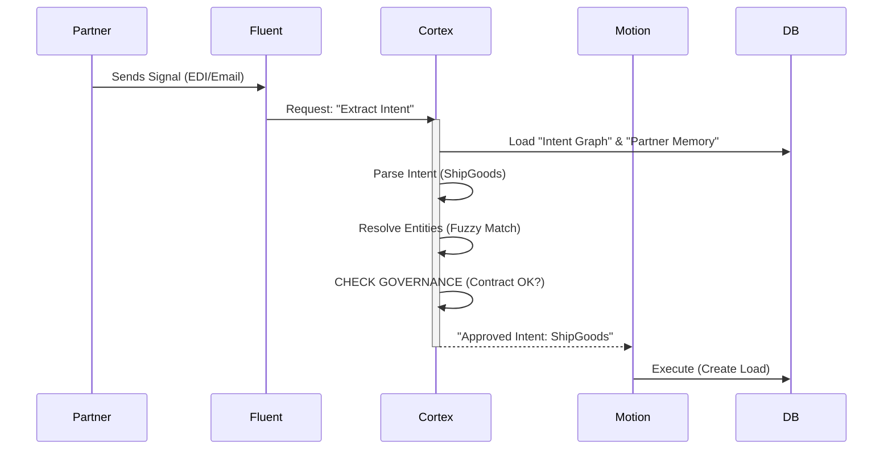

# High-Level Architecture & Design: The Frappe Intent Stack

**Version**: 9.3 (Agentic Core)
**Pattern**: Agentic Micro-Monolith with Governance

## 1. System Topology

We utilize Frappe's natively integrated stack to deliver a seamless AI experience.

| Layer | Component | Role |
| :--- | :--- | :--- |
| **Interface** | **Frappe UI** | Client Portal & Admin Desk |
| **Logic (Apps)** | **Cortex / Fluent / Motion** | Segregated Brain / Perceptor / Actor |
| **Governance** | **Decision Contracts** | The "Constitution" for the AI Agents |
| **Memory** | **ChromaDB + MariaDB** | Vector Semantic + Relational Transactional |

---

## 2. The Application Triad (Detailed Design)

### App 1: `Cortex_AG_AI` (The Brain)
*   **Role**: Cognition & Governance.
*   **Key Logic**:
    *   `IntentParser`: Extracts meaning from signals.
    *   `GovernanceEngine`: Checks `Decision Contracts` before allowing execution.

### App 2: `Fluent_AG_AI` (The Translator)
*   **Role**: Perception.
*   **Key Logic**:
    *   `UniversalIngestor`: Detects signal type (X12 vs Email) and routes it.

### App 3: `Motion_AG_AI` (The Body)
*   **Role**: Execution.
*   **Key Logic**:
    *   `WorkflowEngine`: Creates the actual loads/invoices in the database.

---

## 3. The Data Flow Pipeline (The "Intent Loop")

## 4. Why This Wins

1.  **Safety First**: The `GovernanceEngine` ensures no AI hallucination can bankrupt the company.
2.  **Protocol Agnostic**: Swapping EDI for API requires ZERO changes to the `Cortex` or `Motion` layers.
3.  **Unified Memory**: History informs every decision.
