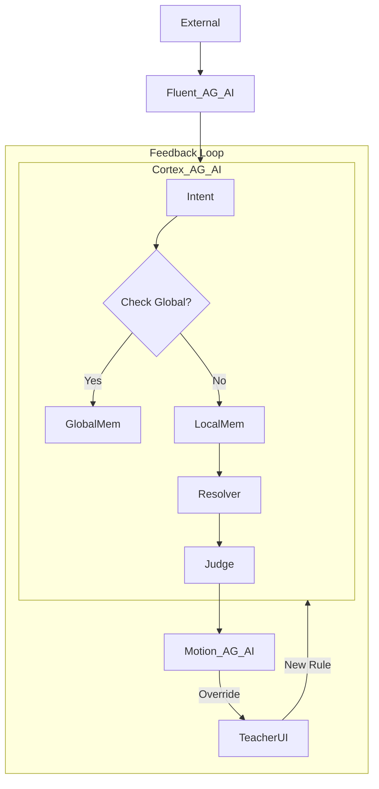

# Frappe App Design: The Networked Triad

**Version**: 9.3 (Agentic Core)
**Context**: Re-imagining the OS for Federated Autonomy.

## 1. The Recommended App Suite (3 Apps)

### App 1: `Cortex_AG_AI` (The Brain & Judge)
**"The Networked Intelligence"**

*   **Role**: Cognition, Governance, and Federation.
*   **Key DocTypes**:
    *   `Intent Node`: The canonical request.
    *   `Decision Contract`: The boundaries.
    *   `Local Memory`: Tenant-specific graph.
    *   `Global Memory`: **(New)** Read-Only Replica of the Network Graph.
    *   `Teacher Feedback`: **(New)** Log of explicit human corrections.

### App 2: `Fluent_AG_AI` (The Translator)
**"The Connectivity Layer"**

*   **Role**: Protocol Master.
*   **Key DocTypes**:
    *   `Exchange Document`: Raw wrapper.
    *   `Intent Mapper`: Rules to convert "Protocol" -> "Intent".

### App 3: `Motion_AG_AI` (The Body)
**"The Operational Reality"**

*   **Role**: The TMS.
*   **Key DocTypes**:
    *   `Shipment Load`: The clean business object.

## 2. The "Data Flow" with Feedback



## 4. Saturn Hardening Modules (v6.0)

To implement the stability guarantee, we add specific DocTypes and Modules.

### App 1: `Cortex_AG_AI` (Hardening)
*   **DocType**: `Schema Registry`
    *   Defines the JSON Schema / Pydantic Model for every Intent.
    *   Enforces versioning (`major`, `minor`, `patch`).
*   **DocType**: `Circuit Breaker Log`
    *   Tracks error rates per `Partner` / `Protocol`.
    *   field: `is_open` (Boolean).

### App 2: `Fluent_AG_AI` (Hardening)
*   **DocType**: `Dead Letter`
    *   Stores signals that failed processing.
    *   Action: `Replay` button.

### App 3: `Motion_AG_AI` (Hardening)
*   **Module**: `Traceability`
    *   Mixin class for all Business DocTypes.
    *   Ensures `_audit_trace_id` is never null.

## 5. Ecosystem & SDK Layer (v8.0)

To win as a Platform, we must let others build on us.

### A. The "Skill" Interface (SDK)
*   **Concept**: Allow Python developers to write "Skills" that Agents can call.
*   **Mechanism**: A `@frappe.whitelist` decorator wrapper that enforces Context & Governance.
*   **Example**: `CustomsBrokerSkill`.
    ```python
    @cortex.skill(input=CustomsDocs, output=ClearanceStatus)
    def check_customs(docs):
        # 3rd party logic
        return status
    ```

### B. The Partner Node (Federated Mesh)
*   **Concept**: Big carriers (e.g., FedEx) don't want to login to our portal. They want to run their own Agents.
*   **Mechanism**: `Cortex` can run in **"Satellite Mode"**.
    *   It syncs Intents securely via the A2A Protocol.
    *   It runs locally on the Partner's infrastructure (or Private Cloud).

## 6. Commercial Modules (v9.0)

To support the Sales motion, we need CRM extensions.

### App 3: `Motion_AG_AI` (Commercial)
*   **DocType**: `Partner Scorecard`
    *   Linked to `Customer` / `Supplier`.
    *   Read-Only Dashboard showing:
        *   `Current Autonomy Tier`
        *   `Signal Health`
        *   `Next Upgrade Requirements`
*   **Purpose**: Gives the Account Exec a script: "Your data quality is 98%, if you fix these 2 fields, we can move you to Autonomous Pricing and save you 20%."

## 7. Normalized Signal Specs (v9.3 Patch)

To support the "Idempotency" requirement from the Roadmap.

### App 2: `Fluent_AG_AI` Updates
*   **API Endpoint**: `/api/v2/ingest`
*   **Required Header**: `X-Idempotency-Key` (UUID)
    *   *Logic*: If Key exists in Redis (TTL 24h), return cached result immediately. Do NOT re-process.
*   **Required Header**: `X-Trace-ID` (UUID)
    *   *Logic*: If missing, generate one. Pass this ID to `Cortex` and `Motion`.
## SDK Decorator Signature (v9.4)
```python
from antigravity.sdk import skill

@skill(name="custom_shipping_cost")
def calculate_cost(intent: Intent) -> float:
    """Calculate shipping cost based on intent payload.
    Returns a float cost that will be attached to the Load DocType.
    """
    # implementation goes here
    return 0.0
```

## Normalized Signal Spec (v9.4) – Recap
| Header | Description |
| :--- | :--- |
| `X-Idempotency-Key` | UUID, deduplication key (TTL 24 h). |
| `X-Trace-ID` | UUID, propagated through Cortex → Motion. |
| `Content-Type` | `application/json` / `application/xml` / `application/pdf`. |

## Partner Scorecard Mock‑up (v9.4)
```markdown
| Partner | Autonomy Tier | Trust Score | Data Quality | Next Upgrade |
| :--- | :--- | :---: | :---: | :--- |
| Acme Logistics | Assist (L1) | 0.78 | 0.85 | Reach Level 2 after 5 % error‑rate drop |
```
